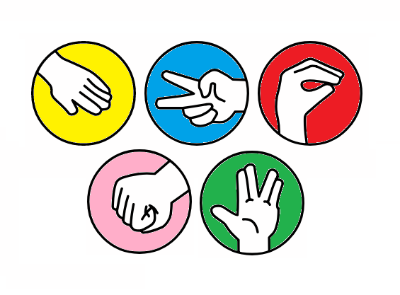

# Qiskit_Hackathon_IITR_2021
Team Random Chaos' repository for Qiskit Fall Fest Hackathon, IITR 2021

## The Problem
<p align = "center"></p>
<p align = "justify">The classical game of Rock-Paper-Scissors becomes biased when 
two people play against each other. One may easily catch on to
their opponent's strategy if the opponent plays in a regular
pattern. One might extend the classical game by introducing new
moves as in the game Rock-Paper-Scissors-Lizard-Spock to
mitigate this. But even then, the internal psychological biases of
the human brain might not let the game be truly random,
creating a stand-off.</p>

<p align = "justify">We propose a solution to this predicament by generating truly
random moves using Quantum Random Number Generator. The
computer will use the random generated moves to play against a
human (who will play by using hand gestures).</p>

## Aim of the project
  * Develop a basic understanding of the quantum computing
  * Explore different ways to create a quantum random number generator
  * Take image input from user and identify different hand gesture.
  * Develop a interface to play Rock-Paper-Scissor-Lizard-Spock against quantum computer.
  * Analysing human psychology based strategy against complete randomness.

## What we achieved in this project
  * Created a Quantum random generator using noise only over QasmSimulator in Qiskit.
  * Linked Qrng with web game .
  * Train a classical machine learning model using python to identify different hand gestures for rock, paper, scissors, lizard and spock.
  * Developed web interface for game using html, css and javascript.


## Instructions
1. Clone this repo into your local machine using the command: 
```
$ git clone https://github.com/tushdon2/Qiskit_Hackathon_IITR_2021.git
```
2. Change your working directory to the cloned repo and create a Virtual Environment. For example, a virtual environment named `venv` can be created using venv by the command: 
```
$ python -m venv venv
```
3. Activate the environment:
  * use `.\venv\Scripts\activate` command in **Windows** 
  * use `$ source venv/bin/activate` in **MacOS** or **Linux**
  * It can later be deactivated by using the `deactivate` command
4. Install the required libraries and packages from the [`requirements.txt`](./requirements.txt) file 
```
$ pip install -r requirements.txt
```
5. Capture dataset images using the [capture_dataset_images.py](./src/capture_dataset_images.py) file. For example, to collect 200 images for **_rock_** gesture, use:
```
$ python3 ./src/capture_dataset_images.py rock 200
```
6. Do this for all the gestures: **_paper_**, **_scissors_**, **_lizard_** and **_spock_**. Also capture images of mundane stuff to classify as **_none_**. Divide the captured images into _**train**_, _**valid**_ and _**test**_ datasets as shown directory structure:
```
assets
  |
  |--data
  |   |
  .   |--train
  .   |   |
  .   |   |-- (all images captured for training)
      |
      |--test (all images captured for testing)
      |
      |--valid (all images captured for validation of model)
```
7. Run the [model_train_and_validate.ipynb](./src/model_train_and_validate.ipynb) and [model_test.ipynb](./src/model_test.ipynb) Jupyter Notebooks to train, validate and test the generated CNN model (will be stored in **_model_** directory in [**_assets_**](./assets) folder).
8. Run the [main.py](./src/main.py) file to play the game.

### **Note :** 
* We have used [WebcamJS](https://github.com/jhuckaby/webcamjs) library to capture images. It's already bundled in the [**webcamjs**](./src/web/webcamjs) directory.
* We have tested the code on **Windows** with **Chrome** _Version 94.0.4606.81_ and **Python 3.9**.
* Set the default download location of your browser (**Chrome** advised) to a **captures** folder inside [**assets**](./assets) directory and turn off the **Ask where to save each file before downloading** feature.
* Install [**Downloads Overwrite Already Existing Files**](https://chrome.google.com/webstore/detail/downloads-overwrite-alrea/lddjgfpjnifpeondafidennlcfagekbp) Chrome extension.

## How to use GUI?
  * Click on configure to configure the webcam
  * Now make the hand gesture of whichever symbol you want to choose (i.e rock, paper, scissor, lizard, spock)
  * Click on “Take Snapshot”
  * Continue playing until either of you or computer scores 5 points
  * Whoever scores 5 points first, wins the game 
  * Start new game for reloading the game .
 
## Rules of the game
   * Scissors decapitates Lizard 
   * Scissors cuts Paper
   * Paper covers Rock
   * Rock crushes Lizard
   * Lizard poisons Spock
   * Spock smashes Scissors
   * Scissors decapitates Lizard
   * Lizard eats Paper
   * Paper disproves Spock
   * Spock vaporizes Rock
   * Rock crushes Scissors, as always.

<p align = "center"></p>
